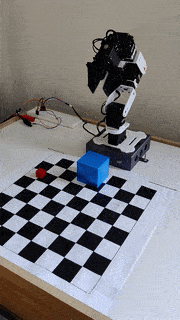
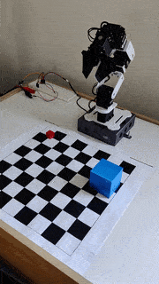
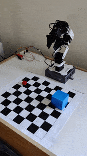
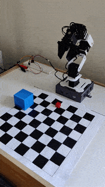
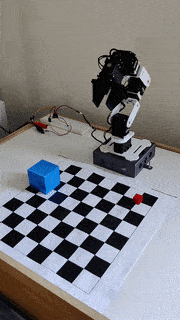
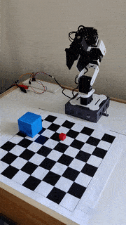
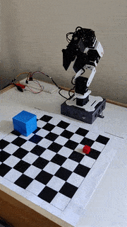
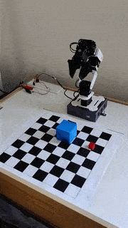
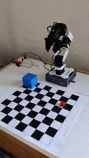
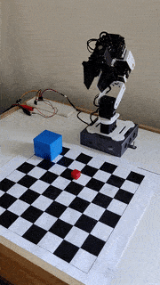

# cube_stack_env
This ROS package contains the motion planning stack and reinforcement learning environment for a customized [ROBOTIS PhantomX Pincher Arm](https://www.trossenrobotics.com/p/PhantomX-Pincher-Robot-Arm.aspx). The robotic manipulator is position controlled using [Dynamixel AX-18A](https://emanual.robotis.com/docs/en/dxl/ax/ax-18a/) motors. The associated simulation environment is equipped with RGBD cameras and IMU sensors, enabling different RL experiments for visual servoing and manipulation tasks.

We took the initial CAD file from [Grabcad](https://grabcad.com/library/phantomx-pincher-robot-arm-1) and then modified it by strengthening the brackets and introducing new spacers within the servos. These changes were aimed to make the CAD specifications as close as possible to the URDF specifications from ROBOTIS. Our modified URDF has both position and effort control transmissions along with options for two different grippers. All the parts for the robot were 3D printed using a [Stratasys Mojo](https://support.stratasys.com/en/printers/fdm-legacy/mojo).


| | | | | |
| --- | --- | --- | --- | --- |
|  |  |  |  |  |
|  |  |  |  |  |

## Pick and Place
Our robot is a 4-DOF robotic manipulator with a parallel gripper. To make it compatible with MoveIt, custom IK plugin was generated using the OpenRAVE's IKFast Kinematics Compiler. We followed [this](https://ros-planning.github.io/moveit_tutorials/doc/ikfast/ikfast_tutorial.html) tutorial. The plugin can be regenerated using the below command on a Ubuntu system with ROS, MoveIt and Docker installed:
```bash
cd <git-root-directory>
rosrun moveit_kinematics auto_create_ikfast_moveit_plugin.sh --name cube_stack --iktype TranslationXAxisAngle4D cube_stack_env/urdf/motion_planning/cube_stack.dae arm arm_base_link gripper_active2_link
```
The driver for the robot depends on [DynamixelSDK](https://emanual.robotis.com/docs/en/software/dynamixel/dynamixel_sdk/overview/). We offer three different programs in this package:

- `roboarm_custom_commander`: Subscribes to the custom message of type `SyncSetPositions.msg` for setting any desired position for the arm. Note that the position values are in the range of 0-1024 according to the Dynamixel AX-18A [specifications](https://emanual.robotis.com/docs/en/dxl/ax/ax-18a/). Publishes `JointState` topic for visualization on RViz. 

- `roboarm_hardware_interface`: Inherits the `ros_control` Hardware Interface for seamless integration with ros_controllers.

- `roboarm_custom_controller`: Similar to `roboarm_custom_commander` but follows a class design similar to ROS hardware_interface. Note that this program subscribes to a `Float64MultiArray` message with targets specified in radians. Publishes `JointState` topic as feedback for control and planning.

In our initial experiments we used Gazebo simulations. Guiding a 4-DOF robot to grasp objects with a desired 6-DOF pose was technically challenging, so we introduced **virtual constraints** to prevent the MoveIt planner from generating infeasible and unsafe trajectories. Specifically, we used a novel **pillar constraint** for surrounding the object of interest such that the angle of approach is restricted to a few good and feasible grasp affordances. Additionally, ground plane and back plane constraints were introduced to restrict full-swing and unsafe trajectories from the planner. To get insight into the problem please refer to this [link](https://answers.ros.org/question/342461/wrong-extremely-non-optimal-moveit-trajectories-on-scene-with-collision-objects/). For the Gazebo simulations we also added a few spherical obstacles to check the robustness of our motion planning stack.

These virtual constraints helped the planner to find simple plans with optimal grasp affordances, resulting in a pick and place success rate of 95% in the Gazebo environment and 78% on real hardware. The sim-to-real gap is primarily due to old and poor motors in our robot that had a play of about 3° for shoulder and elbow joints which miserably affected the FK for a few of the experiments.

The Gazebo simulations use `position_controllers/JointTrajectoryController` from **ros_control** and operate on the hardware interface exposed by `gazebo_ros_control` plugin. However, the hardware implementation involves using the `roboarm_custom_controller` driver program. We use a CubicHermite spline to interpolate the generated MoveIt trajectory at 100 query points. These query points are executed using a closed feedback loop on robot joint states. This method matches the positions and velocities for each intermediate waypoint, resulting in a smooth trajectory. We initially tried using the `roboarm_hardware_interface` program. However, we were unable to fine-tune the controller for MoveIt, which caused the robot to frequently violate the trajectory constraints.

| Virtual Pillar Constraint     | Pick and Place in Gazebo    |
| ------------ | ------------ |
|  |  |

### Run with Gazebo
```bash
# Terminal 1
roslaunch cube_stack_env cube_stack_moveit_gazebo.launch
# Terminal 2
cd <git-root-folder>/cube_stack_env
python scripts/expert_traj_moveit.py
```

## Reinforcement Learning
We created a Gym-compatible environment to enable RL with Gazebo, drawing heavily on the [gym_gazebo](https://github.com/erlerobot/gym-gazebo) package. For our experiments, we trained a Soft Actor Critic (SAC) torque control policy using the [Stable-Baselines3](https://stable-baselines3.readthedocs.io/en/master/) package for the random reaching task. The observation space is multimodal, incorporating RGBD camera input as well as the robot's joint state input. We used a `MultiInputPolicy` policy from sb3 and trained it for 200,000 simulation steps, rewarding the agent for moving the end-effector as close as possible to the red cube.

Our policy network and training algorithm are not well-suited for a vision-based, goal-oriented RL task, which is why we couldn't learn a pick and place policy. This repository has another branch named `mlp-policy` that implements a straightforward MLP policy with an observation that includes joint states, cube location, and end-effector position. The MLP policy performs better than the CNN-based multimodal policy due to the simplicity of the observation space. Additionally, we experimented with imitation learning algorithms trained on the expert MoveIt trajectories using the [imitation](https://imitation.readthedocs.io/en/latest/index.html) package, but the results were not very promising. For the future work we aim to improve this project in the direction of robot learning.

| Multimodal Policy Before Training     | Multimodal Policy After Training    |
| ------------ | ------------ |
|  |  |

The policy successfully learns to reach the red cube from visual inputs and joint states

### Run with Gazebo
Change the argument `control="effort"` in `cube_stack_arm.xacro` ln 8 to run the simulation in torque control mode.
```bash
# Terminal 1
roslaunch cube_stack_env cube_stack_gazebo.launch
# Terminal 2
cd <git-root-folder>/cube_stack_env
python scripts/rl_main.py
```
Above script starts training a SAC policy from scratch. Note that SAC is an off-policy algorithm that uses a reply buffer for sample efficiency. Training requires a minimum 8GB of free RAM on the computer. GPU will be used if available. A minimum 8 core CPU is required to run the simulation at 1.0 real-time factor.

## Acknowledgement
We are very thankful to the  [ASU's 3D Print and Laser Cutter Lab](https://3dprintlab.engineering.asu.edu/makerbot-3d-printing/) for supporting this project with free filament and print access. We are also tankful to [ASU's School of Arts, Media and Engineering](https://artsmediaengineering.asu.edu/about/facilities/fabrication-lab) for access to electronics and fabrication labs.

All the CAD files for the robot can be found in the `cad` folder. We hope this repository will help robotic enthusiasts out there to build on top of our project. Our work on this project is ongoing as we plan to implement vision-based control algorithms and robot learning tasks on top of this system. We will update this repository as we complete other exciting projects in future. If you liked the project and associated demonstrations please consider leaving a :star:

